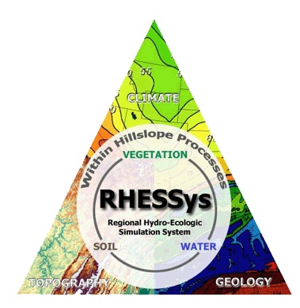

# Welcome to the RHESSys Manual {.unnumbered}

### Authors

**Janet S. Choate, Naomi Tague, Ryan R. Bart**

{width="320"}

## Purpose

Include info about the manual, why it exists, what it is intended for

## Scope

-   What to expect from this book (user will learn....)
-   What the manual covers (practical step-by-step guidance)
-   What it does not cover (underlying theory of the model, all possible functionality)

## Intended Audience

-   Who this is for/Who should be reading this

### Assumed basic prerequisite knowledge

-   **General Modeling**
-   **Basic R/Rstudio**
-   **GIS and Raster/Vector**
-   **Basic Unix/Linux environment (shell, command line, text editor)**
-   **Git/GitHub**
