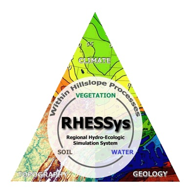

# Welcome to the RHESSys Manual {.unnumbered}

### Authors

**Janet S. Choate, Naomi Tague, Ryan R. Bart**

{width="320"}

## Is RHESSys right for you?

Are you interested in how ecological and hydrological processes interact, and how those interactions may change in response to climate change, land-cover change, or disturbance? Ecohydrology examines these connections and feedbacks among hydrological, ecological, and related systems. Because these systems are interconnected, changes to one system can affect the others, and the resulting interactions can influence how the coupled system responds to external drivers. Understanding these interactions often requires an integrative modeling approach, and RHESSys (Regional Hydro-Ecologic Simulation System) provides a framework for representing them across landscapes and through time.

This manual is designed to help you use RHESSys to investigate your own research questions. Rather than simply learning individual commands or files, you'll learn how the components of a RHESSys project fit together—from project planning and data preparation through model setup, simulation, and evaluation.

## Scope

This manual covers the practical workflow for developing and running RHESSys simulations, including project design, data preparation, model setup, simulation, and evaluation. It includes R-based tools developed to accompany this manual and simplify model setup, input preparation, and simulation management, as well as selected advanced capabilities such as vegetation manipulation and wildfire modeling.

This manual is not intended to be a comprehensive reference for all RHESSys functionality or to provide a detailed treatment of the underlying theory and science. For advanced functionality and additional technical information, see the [RHESSys Wiki](https://github.com/RHESSys/RHESSys/wiki) and the [recommended RHESSys reading](https://jschoate.github.io/RHESSysBook/introduction.html#recommended-readingpublications).

## Intended Audience

This manual is primarily intended for researchers, students, and practitioners who want to use RHESSys to explore a research question involving ecological or hydrological processes. It is designed for those with little or no previous experience with RHESSys who want to learn how to develop and run their own simulations, as well as more experienced RHESSys users looking to expand their skills or explore additional applications of the model.

