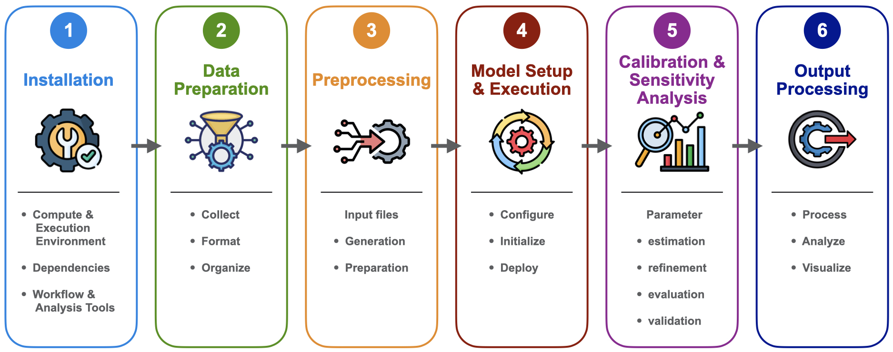

# Introduction (The Model)

## Overview of RHESSys

### What RHESSys is 

-   Description

### Capabilities 

-   Examples of what can be done with the model

### Strengths 

-   Integrated Ecohydological Modeling
-   Spatial distribution of the landscape
-   Feedback loops
-   Fire model

### Limitations 

-   High data demands
-   Can be computationally intensive
-   Maybe any processes that are not well represented? Let users know if the model won't fit their research question

### Comparison of RHESSys to other models 
-   what this model is appropriate for
-   what the trade-offs are

## Recommended reading/Publications

### Foundational papers 
-   publication links with brief descriptions 

### Overview/Review papers 
-   publication links with brief descriptions 

### Applications 
-   publication links with brief descriptions 

## Workflow overview

{fig-alt="RHESSys Modeling Workflow Overview" width="1000"}

-   Step 1: Installation - Set up the RHESSys environment
-   Step 2: Data Preparation - Gather and format spatial, climate, and validation data
-   Step 3: Preprocessing - Generate the landscape representation (Worldfile) and routing (Flowtable) input files
-   Step 4: Model Setup and Execution - Define the simulation rules and run RHESSys
-   Step 5: Calibration & Sensitivity Analysis - Condition the model (Initialize/reach equilibrium), refine parameters, validate performance
-   Step 6: Post Processing - wrangle, analyze, and visualize output data

### Key concepts and terminology 

(define frequently used terms)

-   Spatial hierarchy (basin, hillslope, zone, patch, stratum)
-   Input File types (Worldfile, Header, Flowtable, Tecfile, Parameter/Climate files, Output filters)
-   State variables
-   Spatial/Temporal step (i.e., basin daily, patch monthly)

