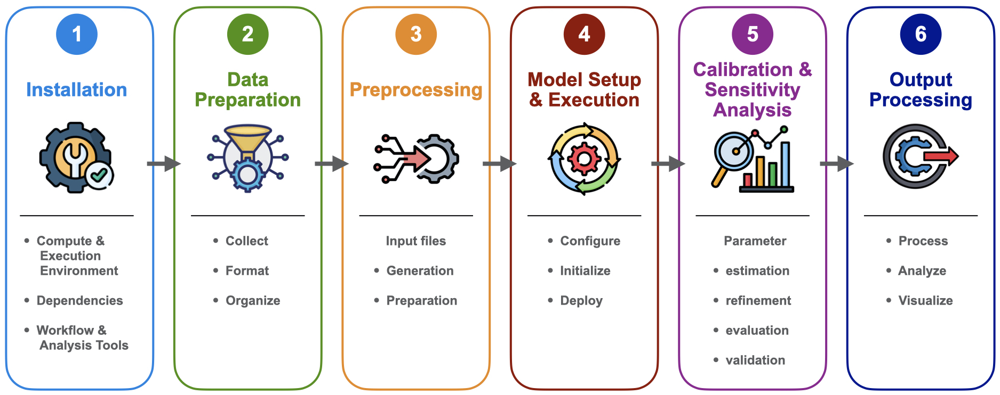

---

editor: 
  markdown: 
    wrap: 72
---

# Introduction (The Model)

## Overview of RHESSys

### What RHESSys is

RHESSys (Regional Hydro-Ecologic Simulation System) is a process-based model of the interactions among energy, water, carbon, and nutrient cycles in the terrestrial environment. As a process based model, RHESSys uses established mechanistic understanding to simulate water, carbon and nutrient fluxes and stores at scales from plots to regions. The model can estimate the trajectories of a wide-range of eco-hydrologic variables including but not limited to vegetation growth and/or decline, soil and litter organic matter accumulation and decomosition, snow accumulation and melt, runoff and streamflow generation and groundwater recharge. The model is both spatial and temporally dynamic, which allows RHESSys to simulate how these energy/water/carbon/nutrient stores and fluxes are distributed over space and evolve through time. The model uses meteorological inputs such as precipitation and temperature, as well as topographic, species-related vegetation, soil, and land use parameters to create this place-based dynamic representation of landscapes.

RHESSys is designed as a community model, and as such, the representation of specific processes has evolved over time. Developments reflect new model application areas and new findings from field based studies. Key developments include coupling with a fire spread and fire effects model, accounting for overstory and understory vegetation, adding complexity/physical realism to vegetation water/carbon/nutrient cycling mechanisms, representation of water pathways that occur at different scales, including deep groundwater flowpaths, surface flow redirection by impervious surfaces, hillslope-scale downslope lateral subsurface redistribution, and plot-scale water transfers. The main code for RHESSys is maintained on GitHub, which tracks the evolution of the model.

### Capabilities

RHESSys can be used as a virtual laboratory to investigate how and why systems behave as they do, and as a digital twin to explore how a particular place may respond to changing conditions.

As a digital twin, RHESSys can provide a place-based estimation of how water resources, carbon sequestration, nutrient export, as well as flood and fire risk, may change under a changing climate or with different land management practices. For example, RHESSys has been used to estimate how seasonal streamflow may change with earlier snowmelt for specific Sierra Nevada watersheds in California, and how summer streamflow may change for watersheds in the Spanish Pyrenees as abandoned pastures are invaded by shrubs. Because RHESSys can be run over a wide range of scenarios, it can be used to explore interactions between land management and climate. For example, RHESSys has been used to estimate the impact of fuel treatments on fire size across historic and possible future climates.

As a virtual laboratory, RHESSys can be used to understand how different mechanisms influence behavior. For example, RHESSys has been used to show how sharing of water between trees and neighboring open space or forest gaps can significantly influence forest drought vulnerability and forest responses to thinning. In this way, RHESSys can be used to help us understand the impact not only of what we know—but also what we don't know. For instance, RHESSys has been used to compare how different assumptions regarding species-specific plant strategies for allocating the carbon they photosynthesize to leaves, stems, and roots influence long-term productivity and carbon sequestration. Similarly, RHESSys can be used to explore the sensitivity of water/carbon/nutrient fluxes to uncertainty and variation in key parameters. For example, RHESSys has been used to estimate how uncertainty or unmeasured spatial variation in soil properties or within species ecophysiological properties impact estimation of streamflow, forest productivity, and drought response.

### Strengths

- Provides Integrated/Coupled Ecohydological Modeling - that links energy, water, nutrients and carbon cycles. For example, evapotranspiration is both influenced by vegetation and influences how vegetation changes over time.
- Accounts for heterogeneity in stores/fluxes and parameters over space,and allows users to determine the resolution of spatial averaging (or scale of the fundamental modeling unit)
- Accounts for lateral transfers and connections between these modeling units - thus model will generate different water availability in riparian areas because it moves water laterally between modelling units
- Supports the integration of human modifications to the landscape into the model - including vegetation management, building roads and adding impervious areas or surface detention storage, adding irrigation and fertilizer inputs
- When modeling fire, accounts for both climate and fuel effects on fire frequency, vegetation structural effects on fire severity and how vegetation recovers following fire
- Is flexible in required inputs - for example, RHESSys will estimate relative humidity if it is not available, but the model can also use observed (or external model) relative humidity inputs
- Has been applied in a wide range of environments - both humid and arid, forests and grasses, urban and non-urban - this previous work has helped to improve RHESSys and previous publications that compare RHESSys with measured data help to build confidence in the model

### Limitations

- High data demands
- Can be computationally intensive

There are also some key processes that are not included in RHESSys that may be important for specific applications. These include: 

- sediment transport and erosion 
- vegetation reproduction 
- species change 
- the influence of the land-surface on the atmosphere (e.g vegetation fluxes changing local climate) 
- other nutrients (such a P) that may be limiting,

The fire model cannot account fine-scale fire behavior, thus while it can estimate fire regimes, fire-return intervals and fire severity, it cannot model the movement and intensity of fire during a particular event.

### Comparison of RHESSys to other models

- what this model is appropriate for
- what the trade-offs are

## Recommended reading/Publications

RHESSys is an eco-hydrologic process-based model - and has similarities to other land-surface models (LSM), hydrologic and earth system models. The following papers provide some additional context into process-based ecohydrologic models in general

Fatichi, S., Pappas, C., & Ivanov, V. Y. (2016). Modeling plant–water interactions: an ecohydrological overview from the cell to the global scale. Wiley Interdisciplinary Reviews: Water, 3(3), 327-368.

To learn more about modeling workflow for coupled eco-hydrologic models see: Brookfield, A. E., Ajami, H., Carroll, R. W. H., Tague, C., Sullivan, P. L., & Condon, L. E. (2023). Recent advances in integrated hydrologic models: Integration of new domains. Journal of Hydrology, 620, 129515. (particularly the Appendix that provides guidance on Selecting an Integrated Hydrologic Model)

A foundational RHESSys paper is Tague, C., Band, L. (2004) RHESSys: Regional Hydro-ecologic simulation system: An object-oriented approach to spatially distributed modeling of carbon, water and nutrient cycling, Earth Interactions 8(19): 1-42.

While the Tague and Band (2004) paper provides information on some core process representation, the model has continued to evolve and many of the process representations and model capabilities have changed. The papers below highlight several key changes. Details of specific process representation and how these have evolved are discussed in relevant sections of this book as needed. Papers on specific applications, such as using the model in urban settings or using the model to track distrubance are provided in appropriate sections in this book

*Fire* Bart, R.R., Kennedy, M.C., Tague, C.L., McKenzie, D. (2020) Integrating fire effects on vegetation carbon cycling within an ecohydrologic model, Ecological Modelling 416: 108880. doi.org/10.1016/j.ecolmodel.2019.108880

*Carbon Allocation in Plants* Garcia, E.S., Tague, C.L., Choate, J.S. (2016) Uncertainty in carbon allocation strategy and ecophysiological parameterization influences on carbon and streamflow estimates for two western US forested watersheds, Ecological Modeling 342: 19-33. doi: 10.1016/j.ecolmodel.2016.09.021

Deeper Groundwater Hydrology Tague, C., Farrell, M., Grant, G., Choate, J., Jefferson A. (2008) Deep groundwater mediates streamflow response to climate warming in the Oregon Cascades, Climatic Change 86: 189-210.

*Soil Nitrogen Cycling* Chen, X., Tague, C.L., Melack, J.M., Keller, A.A. (2020) Sensitivity of nitrate concentration-discharge patterns to soil nitrate distribution and drainage properties in the vertical dimension, Hydrological Processes doi: 10.1002/hyp.13742

*Forest Mortality* Tague, C.L., McDowell, N.G., Allen, C.D. (2013) An integrated model of environmental effects on growth, carbohydrate balance, and mortality of Pinus ponderosa forests in the Southern Rocky Mountains, PLoS ONE 8(11): e80286. doi: 10.1371/journal.pone.0080286

Forest Management Effects

## Workflow overview

{fig-alt="RHESSys Modeling Workflow Overview" width="1000"}

- Step 1: Installation - Set up the RHESSys environment
- Step 2: Data Preparation - Gather and format spatial, climate, and validation data
- Step 3: Preprocessing - Generate the landscape representation (Worldfile) and routing (Flowtable) input files
- Step 4: Model Setup and Execution - Define the simulation rules and run RHESSys
- Step 5: Calibration & Sensitivity Analysis - Condition the model (Initialize/reach equilibrium), refine parameters, validate performance
- Step 6: Post Processing - wrangle, analyze, and visualize output data

### Key concepts and terminology

(define frequently used terms)

- Spatial hierarchy (basin, hillslope, zone, patch, stratum)
- Input File types (Worldfile, Header, Flowtable, Tecfile, Parameter/Climate files, Output filters)
- State variables
- Spatial/Temporal step (i.e., basin daily, patch monthly)
