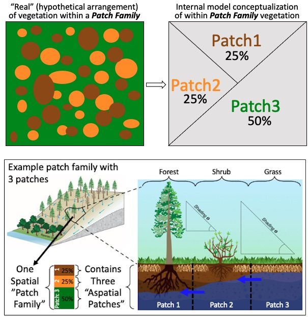

# Fine-scale heterogeneity (The Mosaic)

-   link to video

## Advantages

-   Accounts for forest density reduction, species interactions, and urban eco-hydrology
-   Allows for finer scale lateral water and nutrient transport
-   Allows for within patch family) transfer of water between neighboring patches

### How It Works

Multiscale routing (MSR) allows for interactions (notably the routing of water and shading between) among model units (a patch family unit containing multiple patches) and their associated vegetation types that are typically at scales too small (\<30m) to characterize explicitly. Hypothetically, this allows for the (within patch family) transfer of water between neighboring patches of thinned and unthinned trees, or from a sidewalk to a lawn -- none of which would typically be represented/accounted for when modeling at a 30m grid (patch) cell.

{width="300"}

## Characterization in RHESSys

RHESSys uses patches as the smallest spatial unit. Multiscale routing leverages the existing spatial units in RHESSys by placing multiple patches in the exact same location. These co-located patches together are a patch family, and the routing of multiscale routing, termed "local routing" occurs between these patches, in addition to the normal topographic hillslope routing present in RHESSys which functions as normal.

-   Patches reflect distributions of land cover (species, open-space gaps)

-   Assumes that these land covers are well mixed within a patch family

-   Exchanges based on rules (e.g., root accessibility) and moisture gradients

-   Multiple aspatial patches within a family allow for within patch heterogeneity

-   Aspatial patches can differ by:

    -   vegetation type (biomass, height, root depth)
    -   Surface coverage (open areas, thinned areas, remaining trees)
    -   surface properties (litter)

-   Exchanges of water between trees, between trees and open space (root-based access to neighboring tree stores)

## Multiscale Routing Logic in RHESSys

Multiscale routing can hypothetically simulate any number of water transferring processes that occur at scales smaller than RHESSys models topographically. The first demonstration though will simulate the access/lack of access that trees and other vegetation have due to their roots. New uses of multiscale routing will require rethinking the logic behind how water is routed within a patch family.

## Multiscale Routing in RHESSys -- Shading

Shading can occur when the vegetation of other patches within a patch family creates a higher angle to the horizon than the horizon angle map input to RHESSys.

## Multiscale Routing in RHESSys -- Thinning and Fire

### Thinning works

-   Area can't change
-   Percent cover changes
-   Understory removal happens everywhere
-   Selection thinning on specific aspatial patches \### Fire Spread
-   Slope and wind are the same across patch family
-   Litter load and 1-AET/PET calculated at patch level, turned into probabilities, spatially averaged across patch family \### Fire Effects
-   Done per patch

## Set-up

-   MSR input files
    -   aspatial rules file
    -   aspatial rules map also needed if multiple rules are being used
    -   Format
-   Add Template state variable
-   Generating msr worldfile
    -   add argument to use aspatial rules file to RHESSysPreprocessing

## Running RHESSys with msr

-   Multiscale routing is automatically triggered when the structure of the worldfile & flowtable are formatted for MSR/aspatial patches (which is generated when the asprules command is included when creating the worldfile/flowtable)

## Output

-   Output of multiple patches that belong to a patch family
-   Patch Family ID in addition to Patch ID
